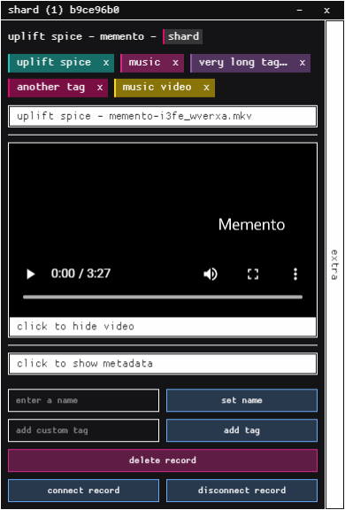
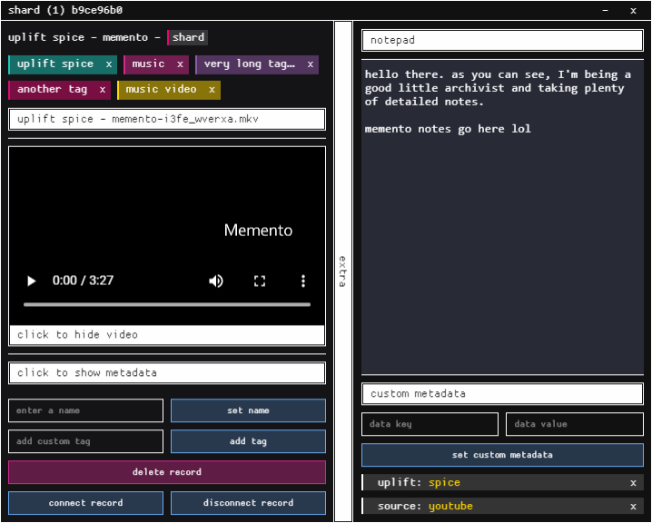
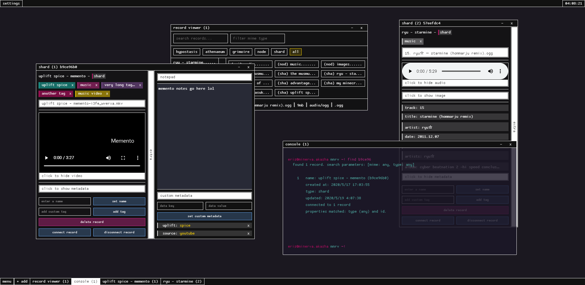

# minerva's akasha.

contents:

-   [running](#running)
-   [features](#features)
-   [screenshots](#screenshots)
-   [contributing](#contributing)
-   [issues](#issues)

this is an offline-first, local-storage-first application for collection, connection, analysis and organization of research data.

for archivists, researchers, internet archaeologists, and other information addicts.

the main idea is to provide a canvas on which to construct and connect webs of information and files. I hope to give researchers an interesting and intuitive interface to conduct any level of research of any topic. minerva's akasha gives you very granular control over pieces of data called "shards", which you can then structure in as complex or simple of a method as you'd like using the other data structures.

from smallest to largest, the structures are:

1.  **shard:** used to store files and tags / metadata / notes relating to the file.

2.  **node:** used to store collections of related (or unrelated, up to you) shards.

3.  **grimoire:** used to store 'libraries' of nodes, like a file folder.

4.  **athenaeum:** used as a large collection of grimoires. useful for storing an entire research project and keeping it separate from other projects.

5.  **hypostasis:** used to reflect athenaea. if you want to start a similar collection of data to one you already have, then you can 'reflect' it using a hypostate. this way, you now have a place to store two similar, but different complex collections of data.

includes data reflection (the ability to separate but connect collections of data that branch off of one parent), note taking utility, data tagging, automatic metadata retrieval, cross-user connection, and more...all contained within a pleasant and intuitive user interface.

_if you want to see more detailed information, dig into `./docs/main` and read the design docs._

## running:

built with react / `create-react-app`.

1.  clone this repo.
2.  compile `/src/main.sass`
3.  in your clone, run `yarn install` and `yarn start`
4.  there you go!

## features:

-   drag and drop functionality allows you to add any file of any type to a record to be prepared for research

-   data can be structured in as simple or complex a system as you'd like.

-   deep interconnection, tagging system, search system, and cross-instance multi-user connections allow for powerful cross-referencing of complex data

-   hypostasis structure allows for reflection of data collections into similar, but different structures so old data can be modified and rearranged without tampering with the original data

-   minerva system tracks and takes care of all the heavy lifting of data organization.

## screenshots:

I'm currently redoing the ui design. so, screenshots will be prepared accordingly. of course, I have retained old screenshots for archival purposes. please look at `/docs/archival` for the old screenshots.

* * *

the current login screen.

* * *

some shards, the application's base structure for data storage:

| side panel collapsed (native metadata hidden)                     |                     side panel expanded (native metadata hidden) |
| :---------------------------------------------------------------- | ---------------------------------------------------------------: |
|  |  |

* * *

a basic idea of what the interface currently looks like, with some of the most common windows. from left to right, a data structure (with the notepad and metadata editor expanded), a record viewer, a console, and another data structure.

* * *

## contributing:

minerva's akasha is very well commented and soon to be very well documented. I aim to make it extremely easy to create additions / modifications to this application (given you know javascript / sass / html). once this software reaches beta, I hope that some people will develop useful additions / plugins for it.

if you want to contribute to minerva's akasha, read `contributing.md`, and do this 8-step process:

1.  fork this repository and clone the repo onto your computer
2.  add this repo as an upstream to that repo: `https://github.com/jpegzilla/minervas-akasha.git`
3.  get latest changes:

    git checkout master
    git fetch --all
    git merge upstream/master

4.  install all deps: `yarn install`
5.  create a feature branch from my master branch
6.  make the feature / fix / whatever and commit the changes to your own branch
7.  make a pr from your branch to my master.
8.  I will review it and merge it if the change is acceptable. done!

also, it doesn't hurt to talk to me about things you want to add to minerva's akasha. I can easily be contacted on discord at `jpegzilla#6969` or on twitter `@jpegzilla`, or email me.

_~ more contribution info coming soon~_

## current issues that I don't know how to fix:

-   on chrome, .ogg files containing only audio are recognized as such. on firefox, .ogg files seem to be automatically given a video mime. I have no idea why this happens or how to fix it, but it is a fairly serious issue. if I know this happens on firefox with .ogg files, what other filetypes have similar problems? what other browsers? I have no clue but the implications of this issue are fairly alarming.

for solved issues see [https://github.com/jpegzilla/minervas-akasha/blob/master/docs/main/solved-issues.md](/docs/main/solved-issues.md).
