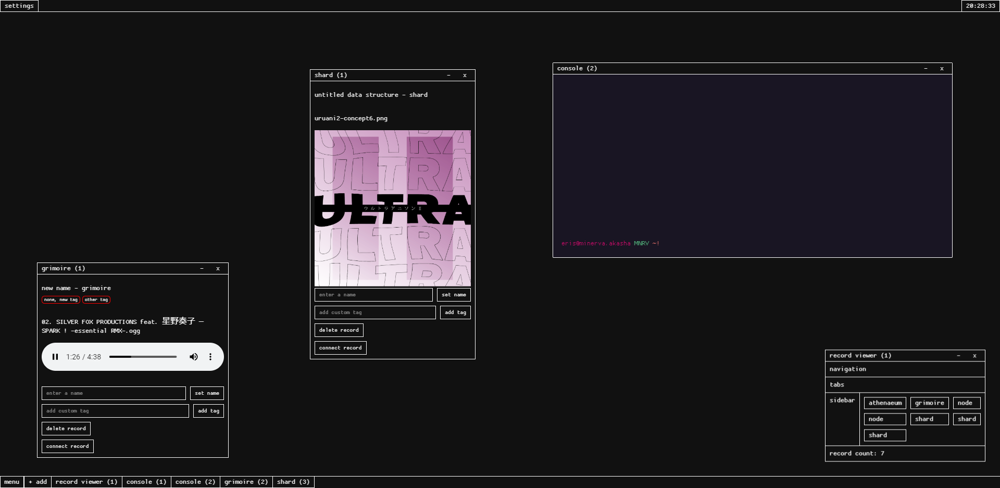
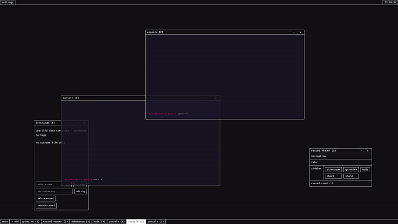

# minerva's akasha.

this is an application for collection, connection, analysis and organization of research data.
for archivists, researchers, and other information addicts.

## features:

-   drag and drop functionality allows you to add any file of any type to a record to be prepared for research

-   data can be structured in as simple or complex a system as you'd like.

-   deep interconnection, tagging system, search system, and cross-instance multi-user connections allow for powerful cross-referencing of complex data

-   hypostasis structure allows for reflection of data collections into similar, but different structures so old data can be modified and rearranged without tampering with the original data

-   minerva system tracks and takes care of all the heavy lifting of data organization.

## screenshots / recordings

## contributing:

minerva's akasha is very well commented and soon to be very well documented. I aim to make it extremely easy to create additions / modifications to this application (given you know javascript / sass / html). once this software reaches beta, I hope that some people will develop useful additions / plugins for it.

***\~contribution info coming soon\~***
